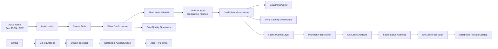

# Civic Signal — Azure Databricks Data Platform

> A public, synthetic procurement-intelligence platform demonstrating enterprise data engineering patterns across Azure Databricks, ADLS Gen2, Unity Catalog, Microsoft Fabric, and GitHub Actions.

Civic Signal is a portfolio implementation of a governed, incremental medallion architecture built on **Azure Databricks**.

The project demonstrates how raw procurement-style source files can move through ingestion, conformance, data-quality controls, dimensional modeling, governance, natural-language analytics, cross-platform interoperability, and CI/CD using production-oriented engineering patterns.

All data in this repository is **synthetic**.  
No private customer, commercial, or production procurement data is included.

---

## Architecture



---

# What This Project Demonstrates

## Incremental Data Engineering

- File ingestion from **Azure Data Lake Storage Gen2**
- Databricks **Auto Loader**
- Schema inference and schema evolution
- Auto Loader schema-location management
- Checkpoint-based incremental file processing
- Bronze append-history pattern
- Record-level incremental Silver processing
- Watermark-based change detection
- Delta Lake `MERGE` for inserts and updates
- Deterministic latest-record selection
- Idempotent pipeline execution

---

## Data Quality

Silver processing applies explicit validation rules before records enter the governed analytical layer.

Invalid records are routed to a dedicated quarantine table instead of silently entering downstream analytics.

Example validation scenarios include:

- missing business keys
- missing opportunity titles
- invalid date values
- negative financial values

The validation layer also checks:

- duplicate business keys
- required fields
- table availability
- expected schema behavior
- Bronze-to-Silver contract boundaries

A deliberate schema-evolution test introduced a new Bronze field while keeping the Silver schema contract unchanged.

---

## Medallion Architecture

```text
ADLS
 │
 ▼
BRONZE
Raw incremental ingestion
Source metadata
Schema evolution
Append history
 │
 ▼
SILVER
Conformed records
Data-quality rules
Watermarks
Delta MERGE
Quarantine
 │
 ▼
GOLD
Dimensional analytical model
Materialized views
Business-ready data
```

The implementation separates:

- **file-level incremental processing** through Auto Loader checkpoints
- **record-level incremental processing** through Silver watermarks and Delta MERGE

---

# Lakeflow Orchestration

The medallion workload is orchestrated through a Databricks Lakeflow Job.

```text
bronze_incremental
        │
        ▼
silver_conformance
        │
        ▼
silver_validation
        │
        ▼
gold_declarative_pipeline
```

The workflow includes:

- explicit task dependencies
- controlled retries
- serverless execution
- validation before Gold processing
- declarative pipeline invocation
- single-run concurrency protection

The complete workflow was also executed remotely through GitHub Actions using workload identity federation.

---

# Gold Dimensional Model

Gold is implemented using a **Lakeflow Spark Declarative Pipeline**.

The analytical model contains:

```text
dim_buyer
dim_category
dim_date
fact_opportunity
```

## Grain

`fact_opportunity`

> One row per current valid opportunity.

The fact table contains references to:

- buyer
- procurement category
- publication date
- closing date
- status
- procurement method
- source
- country
- estimated value
- currency

The pipeline uses declarative expectations for key data-quality constraints.

Example relationship:

```text
                 dim_buyer
                     │
                     │
dim_date ───── fact_opportunity ───── dim_category
```

Validated Gold relationships produced no orphaned buyer, category, or publication-date references.

---

# Unity Catalog Governance

The platform uses **Unity Catalog** as the governance layer.

Implemented capabilities include:

- catalogs and schemas
- managed and external storage
- external locations
- external volumes
- managed volumes
- managed identities
- RBAC
- governed tags
- row filters
- dynamic column masking
- attribute-based access control
- table lineage
- column lineage
- audit logging

Example governed concepts:

```text
civic_scope = procurement
civic_access_dimension = country
civic_sensitivity = financial
```

A South Africa analyst policy demonstrated:

- country-based row filtering
- masking of financial values
- policy inheritance
- governance-admin exemptions

This allowed the same Gold model to expose different governed views depending on user/group membership.

---

# Lineage and Auditability

Unity Catalog lineage was validated across the platform.

Example lineage:

```text
silver.opportunities
        │
        ▼
gold.fact_opportunity
        │
        ├── Databricks Genie
        ├── SQL queries
        └── Fabric publishing layer
```

Column-level lineage was also verified for transformations such as:

```text
country
    → opportunity_country

published_at
    → published_date_key

estimated_value
    → estimated_value
```

Databricks system tables were used to inspect governance and platform activity including:

- authorization evaluation
- effective permissions
- policy operations
- governed tags
- lineage requests
- SQL activity
- pipeline activity

---

# Databricks Genie

A Genie space was created over the Gold dimensional model to demonstrate governed natural-language analytics.

Genie was restricted to the analytical Gold layer:

```text
fact_opportunity
dim_buyer
dim_category
dim_date
```

The semantic configuration included:

- fact-to-dimension joins
- opportunity-count measures
- average estimated value
- publication-month semantics
- country filtering
- opportunity-status filtering
- explicit currency handling instructions

A seven-question benchmark suite was used to validate generated answers against known results.

```text
Benchmark accuracy: 7 / 7
```

The exercise demonstrates that natural-language analytics should be **tested against deterministic expected answers**, rather than evaluated only through ad-hoc prompting.

---

# Microsoft Fabric Interoperability

The project also demonstrates bidirectional Databricks ↔ Microsoft Fabric interoperability.

## Databricks → Fabric

A dedicated publishing layer exposes regular Delta tables derived from the Gold analytical model:

```text
fabric_publish.dim_buyer
fabric_publish.dim_category
fabric_publish.dim_date
fabric_publish.fact_opportunity
```

These tables were consumed through Microsoft Fabric and exposed through OneLake shortcuts.

A Fabric-native analytical table was then created from the shortcut-backed data.

```text
fact_opportunity_monthly_summary_fabric
```

## Fabric → Databricks

The Fabric-native analytical table was subsequently made queryable from Databricks through a OneLake connection and foreign catalog.

This demonstrates:

```text
Databricks
    ↓
Fabric
    ↓
Fabric-native transformation
    ↓
Databricks
```

rather than a one-directional integration only.

---

# Delta Sharing

The project also explored Unity Catalog sharing architecture.

A provider-side Delta Share was configured for selected analytical tables.

The implementation demonstrates the architectural distinction between:

```text
Unity Catalog grants
    → internal Databricks access

Fabric / OneLake interoperability
    → Microsoft analytics-platform integration

Delta Sharing
    → external cross-platform / cross-organization data sharing
```

The repository documents the provider-side sharing pattern; a permanent external consumer environment is intentionally not maintained.

---

# CI/CD with Databricks Asset Bundles

Databricks resources are defined through **Databricks Asset Bundles** rather than relying only on manual workspace configuration.

Managed resources include:

- Lakeflow Job
- Lakeflow Spark Declarative Pipeline
- source notebooks
- pipeline transformation code

Example structure:

```text
civic-signal-dbx/
│
├── databricks.yml
│
├── resources/
│   ├── job_civic_medallion_dev.job.yml
│   └── pipe_civic_gold_dev.pipeline.yml
│
└── src/
    ├── job_civic_medallion_dev/
    │   ├── 10_bronze_autoloader
    │   ├── 11_silver_conformance
    │   └── 12_silver_validation
    │
    └── pipe_civic_gold_dev/
        └── transformations/
            ├── 01_dim_buyer.py
            ├── 02_dim_category.py
            ├── 03_dim_date.py
            └── 04_fact_opportunity.py
```

---

# GitHub Actions and OIDC

GitHub Actions deploys the Databricks bundle using **OpenID Connect workload identity federation**.

No Databricks personal access token or long-lived client secret is stored in the deployment workflow.

```text
GitHub Actions
      │
      ▼
GitHub OIDC token
      │
      ▼
Databricks federation policy
      │
      ▼
Databricks service principal
      │
      ▼
Bundle Validate
      │
      ▼
Bundle Plan
      │
      ▼
Bundle Deploy
```

The deployment pipeline supports:

```text
Push to main
    → validate
    → plan
    → deploy
```

Execution of the actual data workload remains deliberately separate:

```text
Manual GitHub workflow
    → authenticate through OIDC
    → validate bundle
    → run deployed medallion Job
```

This avoids consuming compute simply because source code was pushed.

---

# Repository Structure

```text
.
├── .github/
│   └── workflows/
│       ├── databricks-dev-oidc.yml
│       ├── databricks-dev-adopt.yml
│       ├── databricks-dev-deploy.yml
│       └── databricks-dev-run.yml
│
├── civic-signal-dbx/
│   ├── databricks.yml
│   ├── resources/
│   └── src/
│
└── README.md
```

### Workflow purpose

| Workflow | Purpose |
|---|---|
| `databricks-dev-oidc.yml` | Validates GitHub → Databricks OIDC authentication |
| `databricks-dev-adopt.yml` | One-time adoption/binding of existing Databricks resources |
| `databricks-dev-deploy.yml` | Validates, plans, and deploys Bundle changes |
| `databricks-dev-run.yml` | Manually executes the deployed medallion workflow |

---

# Technology Stack

| Area | Technologies |
|---|---|
| Cloud | Microsoft Azure |
| Storage | ADLS Gen2 |
| Processing | Apache Spark, PySpark |
| Data Platform | Azure Databricks |
| Data Format | Delta Lake |
| Governance | Unity Catalog |
| Ingestion | Auto Loader |
| Orchestration | Lakeflow Jobs |
| Declarative ETL | Lakeflow Spark Declarative Pipelines |
| Analytics | Databricks SQL, Genie |
| Interoperability | Microsoft Fabric, OneLake |
| DevOps | Git, GitHub Actions |
| Deployment | Databricks Asset Bundles |
| Authentication | GitHub OIDC / workload identity federation |
| Languages | Python, PySpark, SQL, YAML |

---

# Engineering Patterns Demonstrated

This repository intentionally focuses on reusable enterprise engineering patterns:

- incremental ingestion
- checkpointing
- watermarking
- idempotency
- Delta MERGE
- schema evolution
- explicit schema contracts
- data-quality quarantine
- medallion architecture
- dimensional modeling
- orchestration dependencies
- declarative pipelines
- serverless compute
- centralized governance
- least-privilege access
- row-level filtering
- dynamic masking
- ABAC
- lineage
- auditing
- natural-language analytics evaluation
- cross-platform interoperability
- infrastructure-as-code-style deployment
- secretless CI/CD authentication

---

# Synthetic Data

All Civic Signal datasets are synthetic and were created specifically for this portfolio project.

Example entities include:

- public-sector buyers
- procurement opportunities
- procurement categories
- publication dates
- closing dates
- procurement methods
- estimated values
- currencies
- countries

The synthetic dataset is intentionally small enough to understand manually while still supporting incremental updates, schema changes, data-quality failures, dimensional relationships, and governance scenarios.

---

# Environment Lifecycle

The Azure Databricks development environment used to build and validate this implementation was intentionally **decommissioned after completion** to avoid unnecessary ongoing cloud cost.

The source code, Bundle configuration, GitHub Actions workflows, architecture, and engineering patterns remain in this repository.

A new Databricks workspace can be connected by updating the appropriate deployment configuration and recreating the required Azure/Unity Catalog prerequisites.

This repository should therefore be treated as a **reproducible reference implementation**, not as a permanently running public SaaS environment.

---

# Key Takeaways

This project goes beyond a notebook-only Databricks demo.

It demonstrates an end-to-end engineering lifecycle:

```text
Source Files
     ↓
Incremental Ingestion
     ↓
Bronze Delta
     ↓
Conformance + DQ
     ↓
Silver Delta
     ↓
Declarative Transformation
     ↓
Gold Dimensional Model
     ↓
Governance + Lineage
     ↓
Natural-Language Analytics
     ↓
Fabric Interoperability
     ↓
Git-controlled Deployment
     ↓
OIDC CI/CD
```

The goal is to demonstrate how Azure Databricks can operate as part of a broader enterprise analytics ecosystem rather than as an isolated Spark environment.

---

## Related Project

### Civic Signal Platform

The Microsoft Fabric implementation of the broader Civic Signal architecture is maintained separately:

[Civic Signal Platform](https://github.com/lkv971/civic-signal-platform)

Together, the repositories demonstrate comparable enterprise data-platform patterns across **Microsoft Fabric and Azure Databricks**.

---

## About

Built as part of my public data-engineering portfolio, with a focus on:

**Microsoft Fabric · Azure Databricks · PySpark · SQL · Delta Lake · Unity Catalog · Lakehouse Architecture · Data Governance · CI/CD**

All commercial implementations, proprietary scoring logic, production credentials, and real procurement data remain outside this repository.
